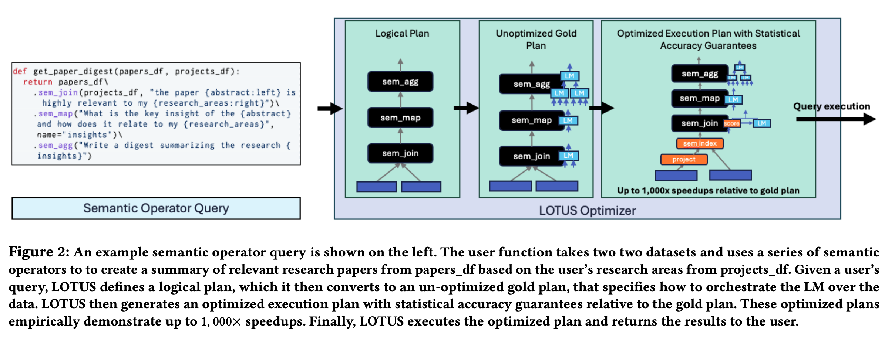
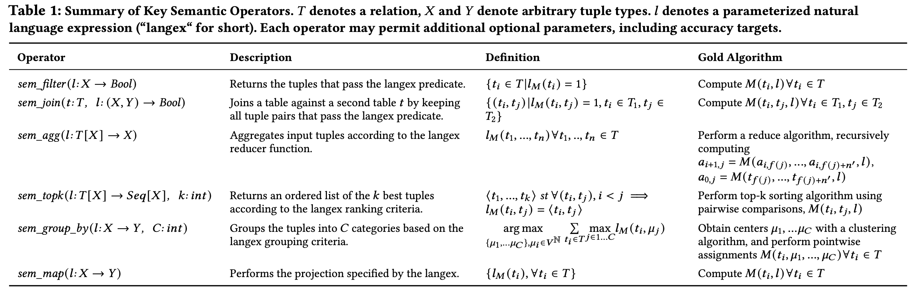

# Lotus

> - Paper: [https://arxiv.org/abs/2407.11418](https://arxiv.org/abs/2407.11418)
> - Github Project: [https://github.com/lotus-data/lotus](https://github.com/lotus-data/lotus)
> - Google CoLab: [https://colab.research.google.com/drive/1OzoJXH13aOwNOIEemClxzNCNYnqSGxVl?usp=sharing](https://colab.research.google.com/drive/1OzoJXH13aOwNOIEemClxzNCNYnqSGxVl?usp=sharing)

LOTUS makes LLM-powered data processing fast and easy.

LOTUS (LLMs Over Tables of Unstructured and Structured Data) provides a declarative programming model and an optimized query engine for serving powerful reasoning-based query pipelines over structured and unstructured data! We provide a simple and intuitive Pandas-like API, that implements semantic operators.

## Example Workflow in semantic engine

## Key semantic operators

