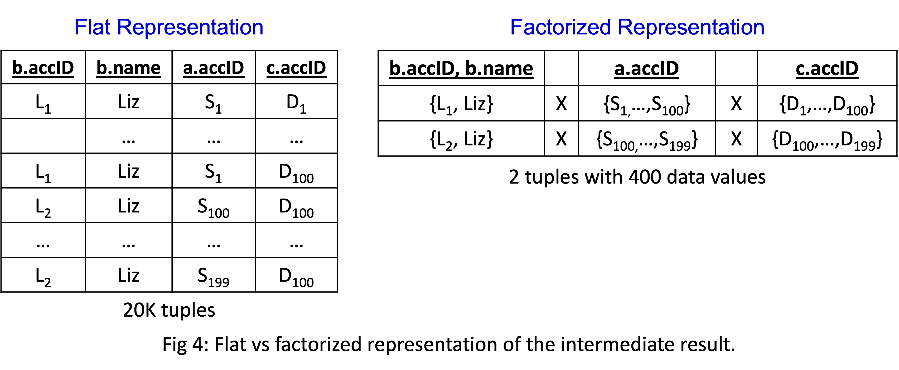

# KUZU Graph Database Management System

> https://www.cidrdb.org/cidr2023/papers/p48-jin.pdf

## Factorization-based Query Processing

> https://blog.kuzudb.com/post/factorization/

Benefits:
- Less copy and data movement
- Fewer Predicate and Expression Evaluations
- Ensuring sequential scans and avoiding full scans of database files