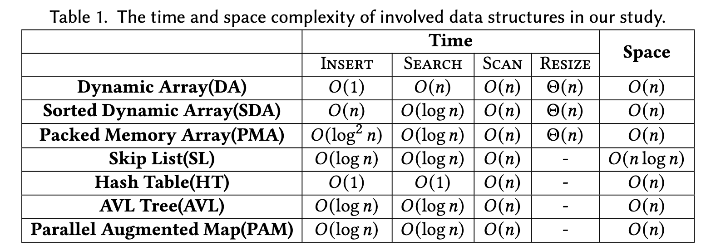
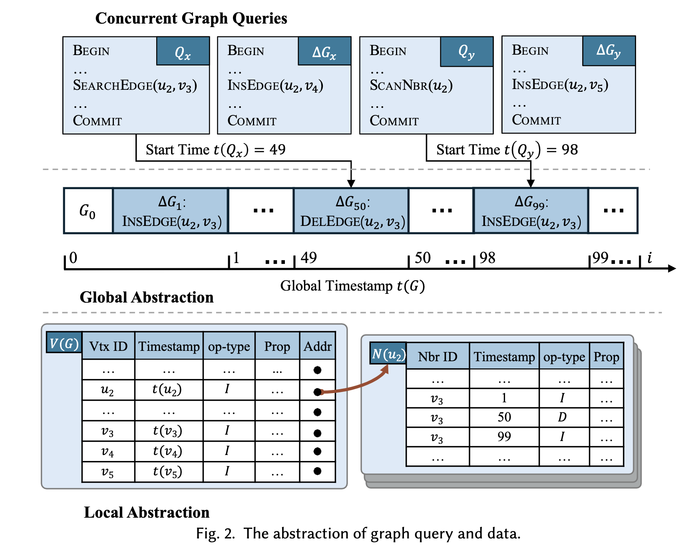
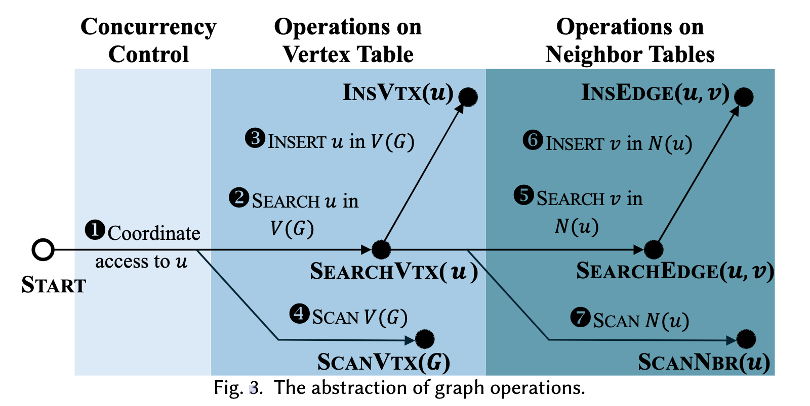
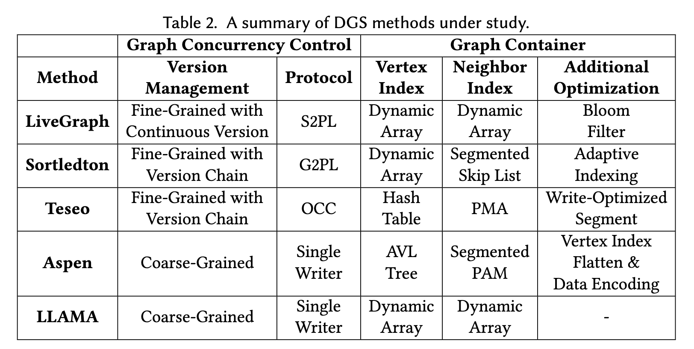
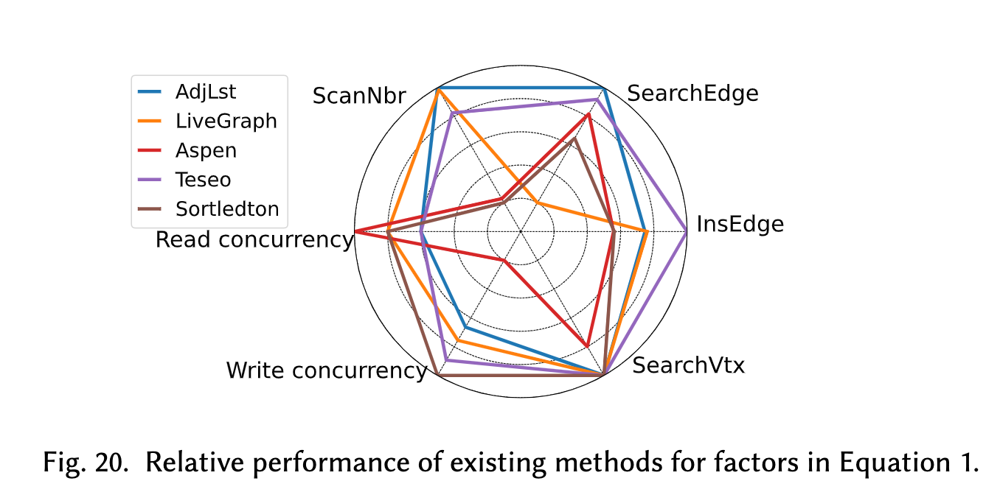

# Revisiting the Design of In-Memory Dynamic Graph Storage

> JIXIAN SU, ..., MINYI GUO
> https://arxiv.org/pdf/2502.10959

评测Code: https://github.com/SJTU-Liquid/DynamicGraphStorage

## 摘要

> The effectiveness of in-memory dynamic graph storage (DGS) for supporting concurrent graph read and write queries is crucial for real-time graph analytics and updates. Various methods have been proposed, for example, LLAMA, Aspen, LiveGraph, Teseo, and Sortledton. These approaches differ significantly in their support for read and write operations, space overhead, and concurrency control. However, there has been no systematic study to explore the trade-offs among these dimensions. In this paper, we evaluate the effectiveness of individual techniques and identify the performance factors affecting these storage methods by proposing a common abstraction for DGS design and implementing a generic test framework based on this abstraction. Our findings highlight several key insights: 1) Existing DGS methods exhibit substantial space overhead. For example, Aspen consumes 3.3-10.8x more memory than CSR, while the optimal fine-grained methods consume 4.1-8.9x more memory than CSR, indicating a significant memory overhead. 2) Existing methods often overlook memory access impact of modern architectures, leading to performance degradation compared to continuous storage methods. 3) Fine-grained concurrency control methods, in particular, suffer from severe efficiency and space issues due to maintaining versions and performing checks for each neighbor. These methods also experience significant contention on high-degree vertices. Our systematic study reveals these performance bottlenecks and outlines future directions to improve DGS for real-time graph analytics.

## 主要贡献

- We propose a simple yet effective abstraction for DGS, enabling a systematic study of existing methods.
- Using this abstraction, we compare key techniques in DGS, e.g., graph containers and concurrency control.
- We develop a generic testing framework based on this abstraction to systematically evaluate existing methods.
- Our findings reveal the strengths of current approaches and highlight critical performance factors, providing valuable insights to guide the design of future DGS systems.

## 详细内容

### DGS抽象

图的数据结构表示

graph query and data抽象

graph operations抽象

### 不同DGS设计的比较

### 评测框架

TODO

### 结论

性能对比:

Key Technical Insights
- segmenting neighbor sets into blocks effectively balances read and write performance
- in the single update setting, fine-grained methods improve write throughput and outperform coarse-grained methods
- adaptive indexing significantly enhances performance by leveraging the sparsity of real-world graphs, reducing LLC misses
- converting tree indexes to arrays improves the performance of long-running queries in coarse-grained methods.